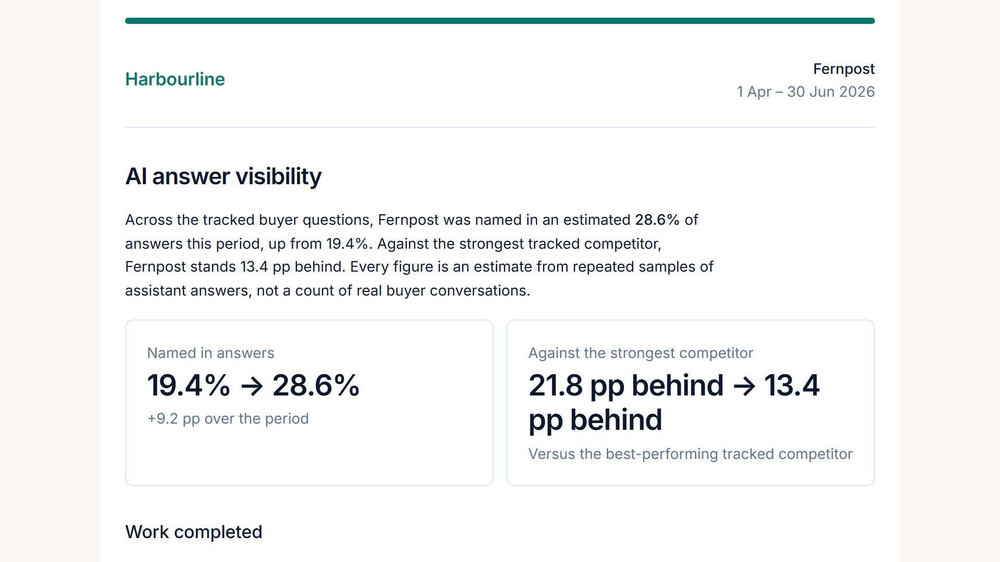
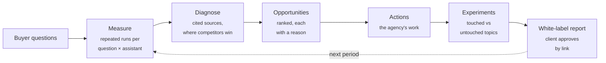
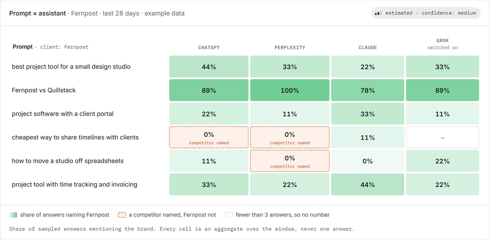
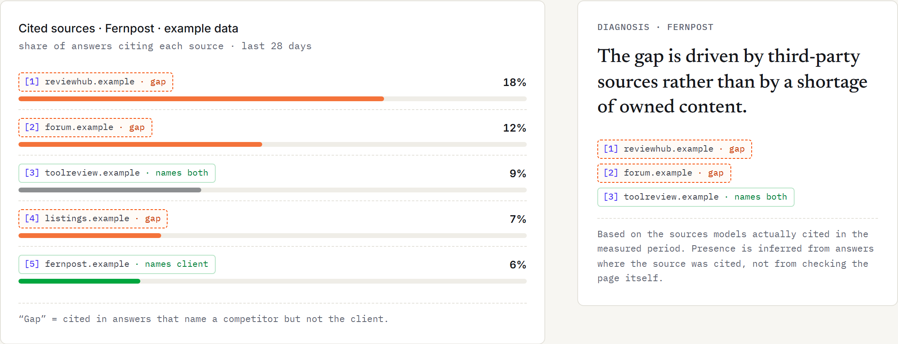
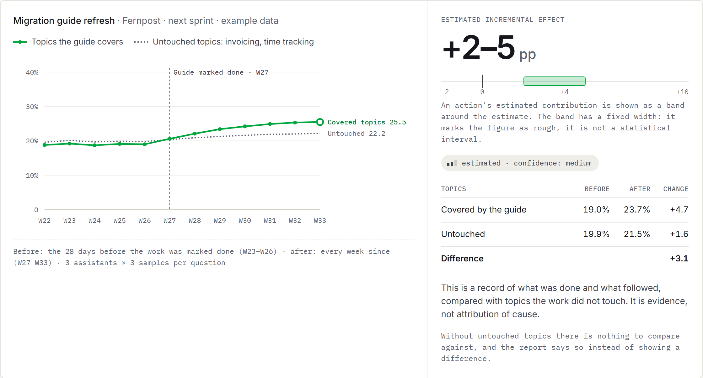

<div align="center">

# Answertally

**AI visibility measurement for agencies.**<br>
How often ChatGPT, Perplexity, Grok and Claude name a brand, which sources they lean on,
what to fix first, and a white-label report the client approves by link.

[](https://github.com/Dev-In-Crypt/answertally/actions/workflows/ci.yml)
&nbsp;[Website](https://answertally.com) · [Sample report](https://answertally.com/sample-report) · [How we measure](https://answertally.com/method) · [Free audit](https://answertally.com/free-audit)



<sub>Fictional brand, example data.</sub>

</div>

## Why it exists

Ask an assistant the same buyer question twice and you get a different list. One screenshot of
ChatGPT naming a client is a coin toss you happened to catch. Answertally asks the same questions
repeatedly on every assistant and reports a **share of answers**, with a range and a confidence
level, never a single answer.

## How it works



| | |
|---|---|
|  | **Measure.** Every question, on every assistant you switch on. Each cell is an aggregate of repeated answers; with fewer than three, it shows no number. |
|  | **Diagnose.** The pages assistants cite, and where a competitor is named while the client is not. |
|  | **Experiments.** After work is marked done, topics it touched are compared with topics it did not. The result is an estimate with a confidence level: evidence of what followed, not a claim of cause. |

**What it will not do:** publish anything to a client's site, show a single "AI score", or put its
own name on the client's report. Reports and PDFs carry the agency's logo and colour only.

---

## For developers

pnpm workspaces + Turborepo.

| Package | What lives there |
|---|---|
| `apps/web` | Next.js 15 App Router, tRPC, Tailwind |
| `apps/worker` | BullMQ worker: runs, parsing, aggregation |
| `packages/core` | Pure business logic: adapters, parsing, metrics, experiment math, report schema |
| `packages/db` | Drizzle schema and migrations, the only place tables are defined |
| `packages/pipeline` | The measurement pipeline shared by web and worker |

```bash
cp .env.example .env && docker compose up -d && pnpm install && pnpm db:migrate && pnpm dev
```

Platform adapters run in mock mode by default (`ADAPTERS_MODE=mock`): no network, no API keys, and
tests never call out.

<details>
<summary><b>Commands</b></summary>

```bash
pnpm dev          # web + worker
pnpm test         # unit and integration tests
pnpm e2e          # Playwright, against a production build
pnpm lint && pnpm typecheck
pnpm db:migrate | db:seed | db:studio
```

`db:seed` also runs one fixture-backed measurement pass through the real pipeline, so a fresh
database comes up with snapshots, opportunities, actions and an experiment. None of those numbers
are written by hand: they come from the same code that runs in production, only the answers come
from fixtures.

</details>

<details>
<summary><b>Assistants and what is not measured</b></summary>

Six surfaces are measured: ChatGPT, Perplexity, Grok and Claude through their own APIs, and
Google AI Overviews and AI Mode through a search-results data provider (DataForSEO,
`DATAFORSEO_AUTH`). A new client is measured on ChatGPT and Perplexity; the rest are switched on
per client in the schedule. Answers count against the monthly AI checks by weight: Grok 5,
Claude 4, everything else 1 (`CHECK_WEIGHTS`). Run `live-check` (see
`packages/core/src/adapters/live-check.ts`) with a key to repeat a live call.

Copilot has no public answer API, so it stays listed as not measured.
Gemini is listed there too, for a different reason: the adapter exists and works, but Google's
terms for grounded search do not allow the results to be analysed, or kept the way every answer
here is kept so a figure can be rechecked. It is not registered even when a key is set.

Perplexity is measured through its Agent API (`fast` preset), which replaced Sonar on 2026-09-27.
That preset answers with an OpenAI model over Perplexity's own search, so each answer records the
actual model in its version string rather than passing it off as Perplexity's.

</details>

<details>
<summary><b>Deploying</b></summary>

One machine with Docker is enough for the first dozens of agencies. CI builds the `web`, `worker`
and `migrate` images for every commit that passes its checks; `scripts/deploy.sh`, run on the
server, pulls the images for the current commit and restarts. Nothing is built on the server, and a
commit without CI images cannot be deployed.

Four services: Postgres, Redis, web, worker. Migrations run as a one-shot service before the app
starts; the application never changes the schema itself, or two instances would do it at once.
Web and worker are separate images because a measurement run takes minutes and must not share a
process with request handling.

`/api/health` answers 503 while the database is unreachable, so the platform can hold traffic back
instead of serving empty reports.

`.env.production` needs at minimum `POSTGRES_PASSWORD`, `DATABASE_URL`, `BETTER_AUTH_SECRET`,
`BETTER_AUTH_URL` and `NEXT_PUBLIC_APP_URL`. Everything else is optional and the product states
plainly what it cannot do without it: `ADAPTERS_MODE` stays on fixtures until platform keys are
present, email is written to the log until `RESEND_API_KEY` is set, and payments are not offered
until a payment provider (Creem) is configured. Every variable is listed in `.env.example`.

</details>

<details>
<summary><b>Public API</b></summary>

Read-only, keyed per agency, created in Settings → API. The key is shown once; only its hash is
stored.

```bash
curl -H "Authorization: Bearer $ANSWERTALLY_KEY" https://your-host/api/v1/clients
```

| Endpoint | Returns |
|---|---|
| `GET /api/v1/clients` | Clients of the agency |
| `GET /api/v1/clients/{id}/visibility` | Prompt × assistant matrix, intervals, movement |
| `GET /api/v1/clients/{id}/sources` | Cited sources and presence |
| `GET /api/v1/clients/{id}/opportunities` | Ranked gaps with score, evidence level and reason |
| `GET /api/v1/clients/{id}/actions` | Work queue, each row with its reason |
| `GET /api/v1/reports` | Reports and their status |

Figures come from the same functions that render the screens, and carry the same intervals: a
number without one becomes "we grew three points" in someone else's dashboard, which the sample
never claimed.

</details>

<details>
<summary><b>Conventions worth knowing</b></summary>

- Every data query goes through `protectedProcedure` + `assertTenant`. A resource belonging to
  another agency returns NOT_FOUND, never FORBIDDEN: the API must not confirm that it exists.
- Visibility is only ever computed from aggregates: at least three samples per prompt per platform,
  weekly windows. Raw responses are always kept, so a parser change can be replayed.
- Every opportunity carries a non-empty reason, enforced by the schema. Opportunities are
  recomputed after every run, and that recompute never overwrites a human decision: status,
  dismissal reason and first-detected date belong to the person.
- Scoring is deterministic and versioned. The 0–100 score is an internal triage number and stays
  internal: in a white-label report it would read as a grade of the client's website.
- Wording that claims proven causation is banned in the UI and in reports; approved phrasings live
  in `packages/core/src/copy.ts` and a test greps for violations.
- Reports and PDFs carry the agency's brand only. A test asserts the product leaves no trace there.
- Nothing is ever published to an external system on the client's behalf.

</details>

Planning documents and the product spec are kept outside this repository.
